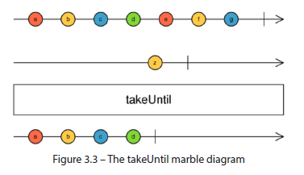

### 3) What is RxJS & Why It Matters Today? Patterns

Reactive Extensions for JavaScript :
- A library for **reactive** programming using `Observables`.
- Enables `asynchronous`, `event-driven`, and `stream-based` programming.
- Core to Angular’s HttpClient, `Forms`, `Routing`, and `Change Detection`.

